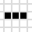

# Le jeu de la vie de Conway

Le jeu de la vie de Conway est un [automate cellulaire](https://fr.wikipedia.org/wiki/Automate_cellulaire) se déroulant au tour par tour sur une grille où chaque case représente une cellule.
Une cellule a deux états possible : elle peut être vivante ou morte.
Les voisins d'une cellule sont ses huits cellule adjacentes (horizontalement, verticalement et en diagonale).
A chaque tour, l'état de chacune des cellules est mis à jour selon l'état de ses voisines.
Les règles de mise à jour sont les suivantes : 
- une cellule morte possédant exactement trois voisines vivantes devient vivante (elle naît),
- une cellule vivante possédant deux ou trois voisines le reste, sinon elle meurt (d'isolement ou, au contraire, de surpopulation). 

Par exemple, la configuration  devient au tour suivant . 

